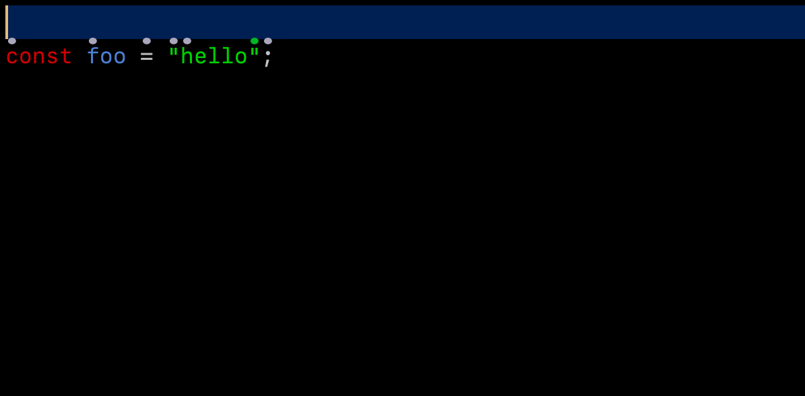

# Experimental features

Here we document features which are currently considered experimental. They are generally functional and well tested, but the API is subject change.

## Wrapper snippets



In addition to wrapping with paired delimiters (eg `"square wrap"`, `"round wrap"`, etc), we experimentally support wrapping with snippets. Cursorless ships with a few built-in snippets, but users can also use their own snippets.

### Enabling wrapper snippets

Add the following line to the end of your `settings.talon` (or any other `.talon` file that will be active when vscode is focused):

```
tag(): user.cursorless_experimental_wrapper_snippets
```

### Using wrapper snippets

#### Command syntax

The command syntax is as follows:

```
"<snippet_name> wrap <target>"
```

#### Examples

- `"try wrap air"`: Wrap the statement containing the marked `a` in a try-catch statement
- `"try wrap air past bat"`: Wrap the sequence of statements from the marked `a` to the marked `b` in a try-catch statement

#### Default scope types

Each snippet wrapper has a default scope type. When you refer to a target, by default it will expand to the given scope type. This way, for example, when you say `"try wrap air"`, it will refer to the statement containing `a` rather than just the token.

### Built-in wrapper snippets

| Default spoken form | Snippet                                       | Default target scope type |
| ------------------- | --------------------------------------------- | ------------------------- |
| `"if wrap"`         | If statement                                  | Statement                 |
| `"else wrap"`       | If-else statement; target goes in else branch | Statement                 |
| `"if else wrap"`    | If-else statement; target goes in if branch   | Statement                 |
| `"try wrap"`        | Try-catch statement                           | Statement                 |

### Customizing spoken forms

As usual, the spoken forms for these wrapper snippets can be [customized by csv](customization.md). The csvs are in the file `cursorless-settings/experimental/wrapper_snippets.csv`.

### Adding your own snippets

To define your own wrapper snippets, proceed as follows:

#### 1. Define snippets in vscode

First, define your snippets in the vscode snippets json file for your given language, as per the [vscode instructions](https://code.visualstudio.com/docs/editor/userdefinedsnippets). The cursorless target will be inserted wherever the variable `$TM_SELECTED_TEXT` appears. See the cursorless built-in [snippet definitions](https://github.com/pokey/cursorless-vscode/tree/main/snippets) for examples.

#### 2. Add snippet to spoken forms csv

For each snippet that you'd like to be able to use as a wrapper snippet, add a line to the `cursorless-settings/experimental/wrapper_snippets.csv` csv overrides file. The first column is the desired spoken form, and the second column is the name of the snippet (ie the key in your vscode snippet json file).

#### 3. (Optional) Configure snippet default scope type

By default, your snippet will expand referenced targets to refer to the containing statement. If you'd like a different default scope type, you can use the `cursorless.wrapperSnippetPreferences` option.

### Customizing built-in snippets

Unfortunately, there is no easy way to customize a built-in cursorless snippet. Your best bet is to [disable](customization.md#removing-a-term) the built-in snippet and then create your own as documented above.
